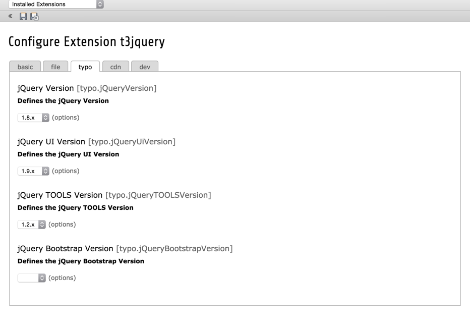

T3Jquery
========

This TYPO3 Extension makes it possible to configure which jQuery based libraries are included in the frontend of your webpage.
To have blazing fast loading times, you can also load the libraries from CDNs or compress them all into one file.

This library also tries to avoid conflicts, if more then one plugin uses jQuery.

